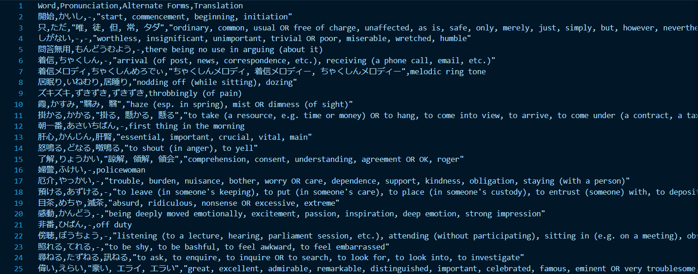

# Takoboto File Processor

This is my Final Project for CS50P by Harvard. We were asked to code an original project with at least 3 unit testable functions, and I decided to challenge myself to create an application that would be useful for my Japanese studies. This project takes in user input, calls a Japanese dictionary API (jisho.org) if the user wants to understand what Parts of Speech the word belongs to, and returns the result as a CSV file.

## Problem statement:

Saving new words in dictionary apps is a common habit amongst language learners, and most dictionary apps allow users to export these word lists.

My dictionary app (Takoboto) is a constant companion in my language studies, and I often export my lists to make room for new vocabulary. The raw csv file looks like this:

And some manual cleaning resulted in this:

I wanted to make things more comprehensible. I had 3 goals:

1) Break down the text data in the "Word" column into individual parts (word, pronunciation, alternate forms) and organise them into individual columns.
2) Provide the option of romaji (romanised Japanese) for people who were still adapting to hiragana and/or katakana.
3) Provide Parts of Speech (pos) data for each word when requested by user. This information was lost when the words were exported.

## Methodology:

To understand how the program works, a brief overview of written Japanese is necessary.

Japanese can be written in 3 ways:
1) Kanji
2) Hiragana
3) Katakana

Hiragana and Katakana are syllabaries - each character represents a syllable used in the Japanese language. Hiragana is typically used for words of Japanese origin and has a smoother, curved form (e.g. めろでぃ) while Katakana is typically used for words with foreign origins and has a sharper, angular form (e.g. メロディ). In Japanese, multiple words can be composed of the same syllables but have completely different meanings. Kanji aids in clarity by giving words context and meaning (e.g. 橋 (hashi, bridge)　vs　箸 (hashi, chopsticks)).

To fulfill all 3 goals, the program operates on the Word column of the file:

As this file was output by a dictionary app, data within the Word column typically follows a certain structure: word, pronunciation, alternate (alt) forms. The program separates and organises each component into individual columns.

However, the data does not always follow this format. This is due to the complexities inherent in written Japanese, as the 3 forms of writing result in a variety of permutations in practice. Let's consider a few cases:

1) 居眠り, いねむり, 居睡り - The typical structure. Word, pronunciation and alt forms are all present. It is possible for words to have more than one alt form.
2) 着信メロディ, ちゃくしんメロディ, 着信メロディー, ちゃくしんメロディー - While word, pronunciation, and alt forms are technically all present, "pronunciation" is a mix of hiragana and katakana and is also an alt form.
3) 開始, かいし - Only word and pronunciation are present. This is fairly common, as not all Japanese words have multiple written forms.
4) ズキズキ, ずきずき - The word is in katakana and has a hiragana alt form. Here, the hiragana is both the pronunciation and the alt form.
5) でか, デカ - The word is in hiragana and has a katakana alt form. Here, the word itself serves as its pronunciation.
6) しがない - The word is in hiragana, with no alt forms.

Versatility is required to handle such variations, and several assumptions and choices were made to simplify the way the program handled the data.

### (Goal 1) Break down text data into individual components:

One base assumption is that "word" always comes first. The program always provides an output for word.

The second base assumption is that pure hiragana forms represent the pronunciation of a word. This presents difficulties in cases like no.2, where no pure hiragana form is available. In such cases, the program converts the "pronunciation" into pure hiragana while also including the unconverted version in the Alternate Forms column.

> e.g. word > 着信メロディ, pr > ちゃくしんめろでぃ alt > ちゃくしんメロディ, 着信メロディー, ちゃくしんメロディー

For pure katakana words like no.4, the program considers the pure hiragana form as both pronunciation and alt form.

> e.g. word > ズキズキ, pr > ずきずき, alt > ずきずき

For pure hiragana words like no.5 and no.6, the word itself is its "pronunciation" and any katakana forms are considered alt forms. In such cases, the program outputs "-" in the Pronunciation column.

> e.g. word > でか, pr > -, alt > デカ / word > しがない, pr > -, alt > -

If any information was not available within the text (e.g. no.3, 5, 6), the program outputs "-" within the relevant columns.

> e.g. (no.3) word > 開始, pr > かいし, alt > - / (no.5) word > でか, pr > -, alt > デカ / (no.6) word > しがない, pr > -, alt > -

The program creates new columns for word, pronunciation, and alternate forms and inserts relevant data in each column. It also drops the old word column, replacing it with the new one.

### (Goal 2) Providing Romaji:

The program provides romaji by romanising outputs in the Pronunciation column. In cases where pronunciation is "unavailable" (e.g. no.5-6), the program romanises output within the word column. A Romanisation column is created for romaji outputs.

### (Goal 3) Providing Parts of Speech (pos) data:

The program provides pos data by calling the jisho.org api on the data in the formatted word column and extracting pos data from the api output. A Parts of Speech column is created for pos data.

## Installation:

    $ pip install -r requirements.txt

## Usage:

    $ python tkbtfileprocessor.py original_file.csv 

OR

    $ python tkbtfileprocessor.py original_file.csv new_file.csv

If a new file name is provided, a new csv file with that name will be created. 
> e.g. new_file.csv

Otherwise, a new file with the current date and time as its name will be created.
> e.g. 2024-11-20 150645.csv

### Scenario 1: Beginner - I've just started learning Japanese!
As a beginner, I want all the information I can get! I need romaji because I'm still not used to reading Japanese, and parts of speech data would help me better understand each word's role in Japanese. Having word, pronunciation, and alternate forms in separate columns would also help with my learning! To get the file I want, I type "all" when prompted:

    Which columns? Input cols (word, pr, alt, roma, pos, or all) separated by whitespace. all

Output File:

### Scenario 2: Experienced - I'm used to reading Japanese!
I'm an experienced reader and just want my data to be more organised for easier reference. I don't need romaji or parts of speech data, so I just type the names of the columns I need when prompted, in any order I want:

    Which columns? Input cols (word, pr, alt, roma, pos, or all) separated by whitespace. word alt pr

Output File:

